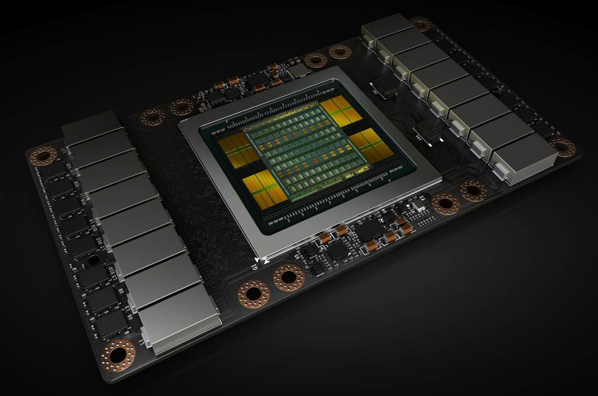
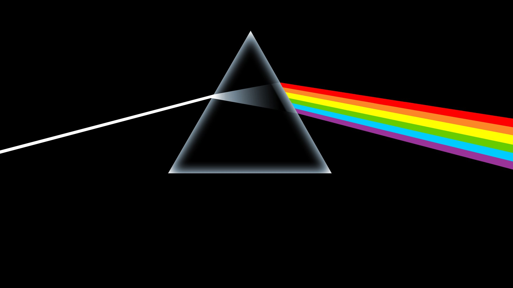
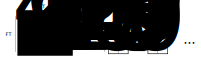
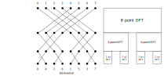

# FPGA versus GPU

## GPU
{.stretch}

::: {.notes}
The primary reason for another FFT library is that we want to generate FFT code in OpenCL for FPGAs. We all know about GPUs. What is different?
:::

## GPU Characteristics
* instruction-based
* Fast
* Cheap
* Hosted: latency is bound by CPU

## FPGA
{.stretch}

::: {.notes}
Atze's blog post explains this better than I
:::

## FPGA Characteristics
* reconfigurable integrated circuit
* Low latency
* High bandwidth
* Streaming
* Read Atze's blog post!

# FFT Algorithm

## Fourier Transform

{.stretch}

::: {.notes}
FFTs let us break up a signal and analyse it in terms of its constituent frequencies. Very similar to how our ear perceives sound: we hear amplitudes (and phases) of different frequencies. 
:::

## Discrete Fourier Transform

* Forward Discrete Fourier Transform
$$Y[l] = \sum_{k=0}^{n-1} X[k] w_n^{-kl},$$
where
$$w_n = \exp\left(\frac{2\pi i}{n}\right).$$

::: {.notes}
This operation is O(N^2) if performed directly.
:::

## Cooley-Tukey
* Factor $n = n_1 n_2$.
$$X[k] = X[k_1 n_2 + k_2] := X[k_1, k_2].$$
Also, let $Y$ take the transposed shape of $X$,
$$Y[l] = Y[l_1 + l_2 n_1] := Y[l_2, l_1].$$

::: {.notes}
This is basically how for example NumPy arrays work.
:::

## Cooley-Tukey
$$Y[l_2, l_1] = \sum_{k_2 = 0}^{n_2 - 1} \left[\left(\sum_{k_1 = 0}^{n_1-1} X[k_1, k_2] w_{n_1}^{-k_1 l_1}\right) w_n^{l_1 k_2}\right] w_{n_2}^{-l_2 k_2}.$$

::: {.notes}
It is actually not very difficult to derive this result, but it would distract from the talk.
:::

## Cooley-Tukey
$$Y[l_2, l_1] = \sum_{k_2 = 0}^{n_2 - 1} \left[\underbrace{\left(\sum_{k_1 = 0}^{n_1-1} X[k_1, k_2] w_{n_1}^{-k_1 l_1}\right)}_{n_1\text{-point DFT}} \overbrace{\ w_n^{l_1 k_2}\ }^\text{twiddles}\right] w_{n_2}^{-l_2 k_2}.$$

::: {.notes}
Now we see that one (O(N^2)) DFT can be computed with a O(N_1 * N_2^2 + N_2 * N_1^1) operation. Say N=20, N^2 = 400
:::

## Using arrays


::: {.notes}
4*5^2 + 5*4^2 = 180

If we try the same with 2x2, we get no speed-up.
:::

## Butterflies
{.stretch}

::: {.notes}
Often FFT people talk about butterflies!
:::

## Dataflow
 <!--{.stretch}-->

::: {.notes}
They mean this pattern.
:::

## Existing generators: cuFFT and clFFT
 <!--{.stretch}-->

::: {.notes}
If you have a large FFT and want it computed on a GPU, the different stages of the FFT are managed from the host, or at the least, barriers are placed. Each stage of the FFT is computed in-place.

Barriers are not an FPGA thing.
:::

# The Fastest Fourier Transform in the West

## Codelets & plans
* OCAML optimizing code generator
* FFT synthesis in C runtime: plans

## 2-point FFT
``` {.c style="font-size: 22pt"}
void
fft2 (const R * ri, const R * ii, R * ro, R * io, stride is, stride os, INT v,
      INT ivs, INT ovs)
{
  {
    INT i;
    for (i = v; i > 0;
         i = i - 1, ri = ri + ivs, ii = ii + ivs, ro = ro + ovs, io =
         io + ovs, MAKE_VOLATILE_STRIDE (8, is), MAKE_VOLATILE_STRIDE (8, os))
      {
        E T1, T2, T3, T4;
        T1 = ri[0];
        T2 = ri[WS (is, 1)];
        ro[WS (os, 1)] = T1 - T2;
        ro[0] = T1 + T2;
        T3 = ii[0];
        T4 = ii[WS (is, 1)];
        io[WS (os, 1)] = T3 - T4;
        io[0] = T3 + T4;
      }
  }
}
```

::: {.notes}
This is what an FFT looks like when generated by FFTW's genfft.
:::

## 2-point twiddles
``` {.c style="font-size: 22pt"}
void
fft2 (R * ri, R * ii, __constant const R * W, stride rs, INT mb, INT me,
      INT ms)
{
  {
    INT m;
    for (m = mb, W = W + (mb * 2); m < me;
         m = m + 1, ri = ri + ms, ii = ii + ms, W =
         W + 2, MAKE_VOLATILE_STRIDE (4, rs))
      {
        E T1, T8, T6, T7;
        T1 = ri[0];
        T8 = ii[0];
        {
          E T3, T5, T2, T4;
          T3 = ri[WS (rs, 1)];
          T5 = ii[WS (rs, 1)];
          T2 = W[0];
          T4 = W[1];
          T6 = FMA (T2, T3, T4 * T5);
          T7 = FNMS (T4, T3, T2 * T5);
        }
        ri[WS (rs, 1)] = T1 - T6;
        ii[WS (rs, 1)] = T8 - T7;
        ri[0] = T1 + T6;
        ii[0] = T7 + T8;
      }
  }
}
```

## Generating OpenCL kernels
* add `__kernel` and `__const` namespaces

## 2-point FFT
``` {.opencl style="font-size: 22pt"}
__kernel void
fft2 (__global const R * ri, __global const R * ii, __global R * ro,
      __global R * io, stride is, stride os, INT v, INT ivs, INT ovs)
{
  {
    INT i;
    for (i = v; i > 0;
         i = i - 1, ri = ri + ivs, ii = ii + ivs, ro = ro + ovs, io =
         io + ovs, MAKE_VOLATILE_STRIDE (8, is), MAKE_VOLATILE_STRIDE (8, os))
      {
        E T1, T2, T3, T4;
        T1 = ri[0];
        T2 = ri[WS (is, 1)];
        ro[WS (os, 1)] = T1 - T2;
        ro[0] = T1 + T2;
        T3 = ii[0];
        T4 = ii[WS (is, 1)];
        io[WS (os, 1)] = T3 - T4;
        io[0] = T3 + T4;
      }
  }
}
```

## 2-point twiddles

``` {.opencl style="font-size: 22pt"}
__kernel void
fft2 (__global R * ri, __global R * ii, __constant const R * W, stride rs,
      INT mb, INT me, INT ms)
{
  {
    INT m;
    for (m = mb, W = W + (mb * 2); m < me;
         m = m + 1, ri = ri + ms, ii = ii + ms, W =
         W + 2, MAKE_VOLATILE_STRIDE (4, rs))
      {
        E T1, T8, T6, T7;
        T1 = ri[0];
        T8 = ii[0];
        {
          E T3, T5, T2, T4;
          T3 = ri[WS (rs, 1)];
          T5 = ii[WS (rs, 1)];
          T2 = W[0];
          T4 = W[1];
          T6 = FMA (T2, T3, T4 * T5);
          T7 = FNMS (T4, T3, T2 * T5);
        }
        ri[WS (rs, 1)] = T1 - T6;
        ii[WS (rs, 1)] = T8 - T7;
        ri[0] = T1 + T6;
        ii[0] = T7 + T8;
      }
  }
}
```

# Writing a code-generator in Haskell

## Problem
* FFT Synthesis
* Control loop structure:
  - parallel loops
  - loop fusion

## Why Haskell
* Abstract data types:
  * build an expression language

## Abstract data types
``` {.haskell style="font-size: 22pt"}
newtype Variable a = Variable Text
  deriving (Show)

data Function :: [*] -> * -> * where
  Function :: Text -> Function a b
  deriving (Show)

data Expr a where
  Literal        :: (Show a) => a -> Expr a
  ArrayRef       :: Array a -> Expr (Array a)
  VarReference   :: Variable a -> Expr a
  TUnit          :: Expr ()
  TNull          :: Expr (HList '[])
  (:+:)          :: (Show a) => Expr a -> Expr (HList b) -> Expr (HList (a ': b))
  Apply          :: Function a b -> Expr (HList a) -> Expr b
```

## Why Haskell
* Abstract data types:
  * build an expression language
* Pattern matching:
  * manipulate and transform expressions

## Pattern matching
``` {.haskell style="font-size: 22pt"}
instance Syntax (Expr a) where
  generate (Literal x)                 = tshow x
  generate (ArrayRef x)
    | (offset x) == 0                  = name x
    | otherwise                        = name x <> " + " <> tshow (offset x)
  generate (VarReference (Variable x)) = x
  generate (Apply (Function f) a)      = f <> "(" <> generate a <> ")"
  generate (a :+: TNull)               = generate a
  generate (a :+: b)                   = generate a <> ", " <> generate b
  generate _                           = ""
```

## Why Haskell
* Abstract data types:
  * build an expression language
* Pattern matching:
  * manipulate and transform expressions
* And all the other reasons:
  * Type-safety
  * Declarative code
  * Functional goodness
  
## 20-point FFT

``` {.opencl style="font-size: 22pt"}
__kernel void
fft20(__global const float *input, __global float *output)
{ 
  // following two blocks can be done in parallel
  {
    notw_5(input, input + 1, output, output + 1, 4, 1, 2, 2, 5);
    twiddle_2(output, output + 1, w_5_2, 5, 0, 5, 1);
  }
  {
    notw_5(input + 2, input + 3, output + 20, output + 21, 4, 1, 2, 2, 5);
    twiddle_2(output + 20, output + 21, w_5_2, 5, 0, 5, 1);
  }
  twiddle_2(output, output + 1, w_10_2, 10, 0, 10, 1);
}
```
